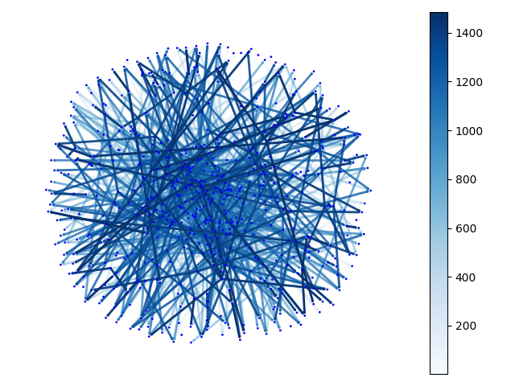
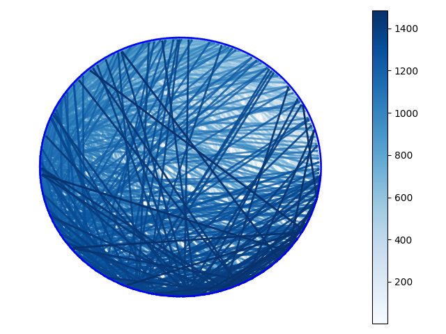

# Day 7

> to be added later

## Visualisations

Generated using maptlotlib and networkx.





```
import matplotlib as mpl
import matplotlib.pyplot as plt
import networkx as nx

pos = nx.layout.circular_layout(DG)

node_sizes = [1 for i in range(len(DG))]
M = DG.number_of_edges()
edge_colors = range(2, M + 2)
edge_alphas = [(5 + i) / (M + 4) for i in range(M)]

nodes = nx.draw_networkx_nodes(DG, pos, node_size=node_sizes, node_color="blue")
edges = nx.draw_networkx_edges(
    DG,
    pos,
    node_size=node_sizes,
    arrowstyle="->",
    arrowsize=1,
    edge_color=edge_colors,
    edge_cmap=plt.cm.Blues,
    width=2,
)
# set alpha value for each edge
for i in range(M):
    edges[i].set_alpha(edge_alphas[i])

pc = mpl.collections.PatchCollection(edges, cmap=plt.cm.Blues)
pc.set_array(edge_colors)
plt.colorbar(pc)

ax = plt.gca()
ax.set_axis_off()
plt.show()```
